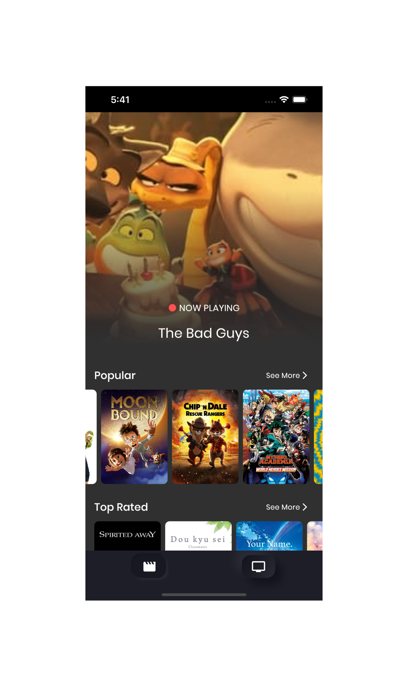
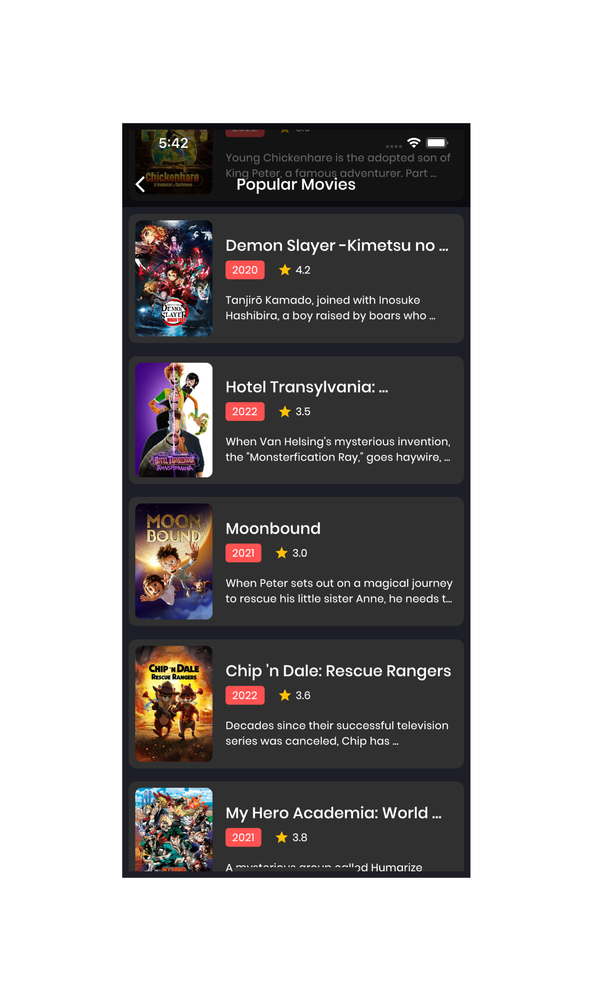
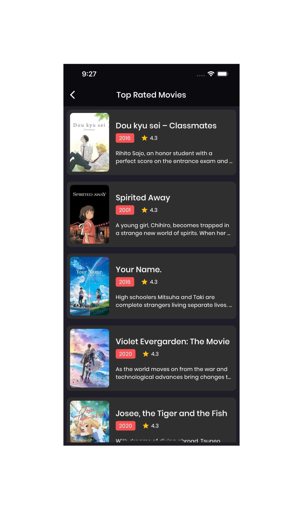

<h1>Movies App</h1>

> This project is powered by FLutter **3.0.5** and dart **2.17.6**. And is built using [Movies Api](https://www.themoviedb.org/).

The main packages used in the project:

```yaml
cupertino_icons: ^1.0.2
equatable: ^2.0.5
dio: ^4.0.6
dartz: ^0.10.1
flutter_bloc: ^8.1.1
get_it: ^7.2.0
animate_do: ^2.1.0
cached_network_image: ^3.2.2
carousel_slider: ^4.1.1
google_fonts: ^3.0.1
shimmer: ^2.0.0
```

# Screenshots:

<h3> 1- Home screen </h3>

<p align="center">
  

</p>

<h3> 2- Popular Movies screen </h3>

<p align="center">
  

</p>
<h3> 3- Top Rated Movies screen </h3>

<p align="center">
  

</p>

## Getting Started

This project is a starting point for a Flutter application.

A few resources to get you started if this is your first Flutter project:

- [Lab: Write your first Flutter app](https://docs.flutter.dev/get-started/codelab)
- [Cookbook: Useful Flutter samples](https://docs.flutter.dev/cookbook)

For help getting started with Flutter development, view the
[online documentation](https://docs.flutter.dev/), which offers tutorials,
samples, guidance on mobile development, and a full API reference.
